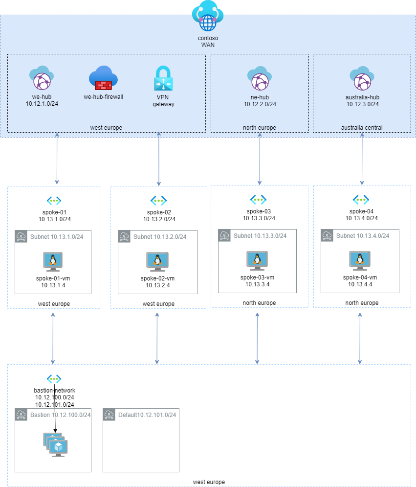

# Create an Azure Virtual WAN playground to test configurations and customer scenarios

This repo contains an ARM template to that can be used to deploy a playground composed by:

* an Azure Virtual WAN network aligned with with Microsoft Enterprise scale landing zone reference architecture
* a simulated on-premise architecture composed by a network, a client machine and a gateway to be used to test connectivity with the cloud

# Deploy to Azure
You can use the following button to deploy the demo to your Azure subscription:

| playground parts| &nbsp; |
|---|---|
| deploys virtual WAN playground | 

understand this configuration: https://blog.cloudtrooper.net/2020/11/17/virtual-wan-secure-hubs-in-multiple-region

test deploy VM [](https://portal.azure.com/#create/Microsoft.Template/uri/https%3A%2F%2Fraw.githubusercontent.com%2Fnicolgit%2Fazure-virtual-wan-playground%2Fmain%2Flinux-vm-deploy.json